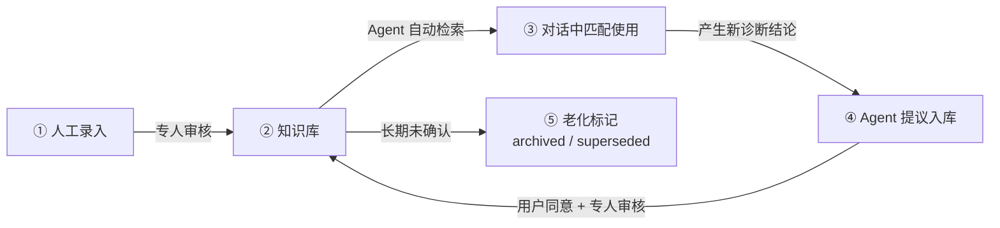
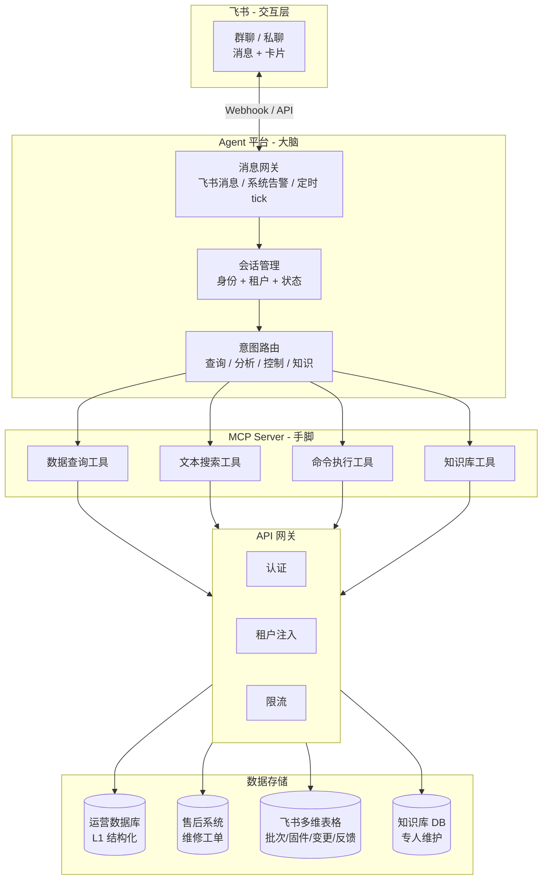
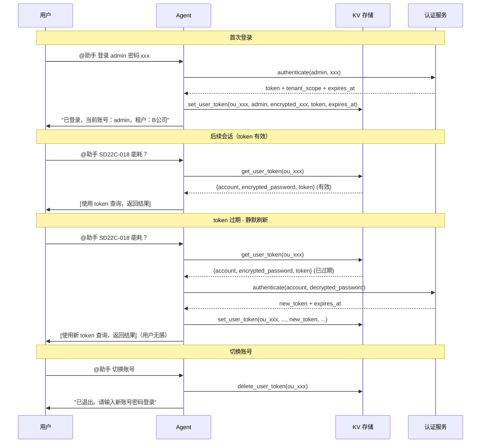

# Agent 产品需求文档：无人车智能运营助手

**版本**: 2.1
**日期**: 2026-07-22
**状态**: Draft
**关联背景**: 基于智慧环卫无人车运营场景（车型 SD15/SD22C，约 200 台车，5 家项目公司）

---

# 1. 📌 项目概述与背景

## 1.1 Agent 名称与定位

- **名称**：无人车智能运营助手
- **一句话定位**：让制造厂工程师在飞书会话里完成"看数据 → 分析问题 → 执行操作"的闭环，用自然语言对话替代在多个系统之间来回切换。
- **部署位置**：公司 Agent 平台，通过 MCP 协议接入后端能力，飞书会话作为交互入口。

## 1.2 背景与目标

### 业务背景

制造厂工程师日常需要回答三类问题，当前每类都需要切换不同系统：

| 问题类型 | 当前方式 | 痛点 |
|---------|---------|------|
| "018 号车今天跑得怎么样" | 打开运营看板，选租户→选车→选日期 | 数据在，但要翻 |
| "018 接管率为什么高了" | 看板看完 → 打开售后系统翻工单 → 打开飞书文档查批次/固件 → 自己关联 | 三个系统来回查，分析靠人脑串 |
| "把 018 的充电任务取消掉" | 打开任务管理页面 → 找到任务 → 点取消 | 又多一个系统 |

### 为什么不是再加一个看板

看板只能呈现"已经变成数字的东西"。制造厂大量有价值的信息是文本形态——维修工单、设计变更记录、客户反馈、固件 Release Note。当工程师问"SD22C-018 能耗为什么高了"，AI 能自己去翻这些文本，找到"018 上个月换过电机控制器，更换后能耗就上来了"，再往前翻"而且它是 Q4 批次的，Q4 正好换了轴承供应商"——看板做不到这件事。

**原则：能用看板回答的问题，不走 Agent。Agent 只做看板做不了的事。**

### 核心目标

| 目标 | 现状 | 目标值 |
|------|------|:---:|
| 远程诊断耗时 | 人工约 15-20 分钟（翻多个系统） | < 3 分钟 |
| 问题未覆盖率 | — | < 30% |
| 周活跃使用次数 | — | ≥ 15 次/周（MVP 后） |
| 知识条目沉淀 | — | ≥ 30 条（P1 结束时） |
| 诊断吻合率 | — | ≥ 70%（一期允许推测性结论被修正） |

## 1.3 成功标准 (Success Metrics)

### 硬卡点（上线必须达标，可从日志/测试集直接计算）

| 指标 | 目标 | 怎么算 | 数据来源 |
|------|:---:|------|------|
| **查询准确率** | ≥ 95% | 设计 30+ 条标准查询作为测试集，人工逐条判定"返回数据是否正确"。准确率 = 正确数 ÷ 总数 | 测试集 + 人工判定 |
| **首次响应时间** | < 5 秒 | 用户发送消息 → Agent 返回首条内容的时间差。统计所有会话的 P50 / P95，P95 必须 < 5 秒 | 消息日志时间戳 |
| **诊断总耗时** | < 3 分钟 | 从用户输入 VIN+问题 到 Agent 输出完整诊断结论的时间差。取所有诊断会话的中位数 | 会话日志时间戳 |
| **未覆盖率** | < 30% | Agent 明确回复"当前数据/能力无法回答"的提问数 ÷ 总提问数。Agent 在每条无法回答的回复中标记 `[UNCOVERED]`，方便日志统计。需每周人工抽检 20 条确认 Agent 没有硬编 | 日志关键词 `[UNCOVERED]` + 周度抽检 |
| **无严重安全缺陷** | 0 项 | 确认流程不可绕过、租户隔离不可绕过、密码不在日志中回显。安全审查 checklist 逐项验证 | 代码审查 + 渗透测试 |

### 观察指标（上线后持续跟踪，不卡上线）

| 指标 | 目标 | 怎么算 | 数据来源 |
|------|:---:|------|------|
| **诊断吻合率** | ≥ 70% | 每周抽 5 条远程诊断记录，售后技术支持手动标注"吻合/部分吻合/不吻合"。P1 考虑在售后系统加"AI 诊断是否准确"回填字段，实现自动化统计 | 人工抽检标注 |
| **告警追问率** | ≥ 30% | 告警推送到飞书后 1 小时内，用户在同一会话里发了任何消息，算"追问"。追问数 ÷ 告警推送总数 | 消息日志时间戳 |
| **周调用次数** | ≥ 15 次 | 日志里数 @机器人 的次数 | 消息日志 |
| **平均对话轮次** | ≤ 5 轮 | 一次完整诊断从开始到结束的对话轮数。取中位数 | 会话日志 |
| **知识检索命中率** | ≥ 80%（仅在知识库已覆盖该问题时统计） | 每周抽 10 条分析类对话，人工判断"知识库是否帮上忙"。不做自动统计，不分母难界定 | 人工抽检 |

### 为什么有些指标不做自动统计

- **诊断吻合率**依赖"现场确认结果"作为 ground truth，但现场确认不一定回流到系统。MVP 阶段人工抽检解决，P1 在售后系统加回填字段
- **知识检索命中率**的分母难界定——"知识库已覆盖该问题"本身就是需要人判断的事。不做卡点
- **告警追问率**的"追问"定义需共识——用户看了没回，可能是不需要追问，也可能是没看到。暂时用 1 小时内是否发消息作为代理指标

---

# 2. 🎯 Agent 能力与行为定义

## 2.1 用户角色与场景

### 目标用户

| 角色 | 典型场景 | 核心诉求 |
|------|---------|---------|
| **质量工程师** | 盯着已售车辆的异常趋势，找批次问题 | "这批车的同一个部件是不是都有问题？" |
| **产品改进工程师** | 分析实际运营数据，驱动下一代设计 | "传感器老在什么条件下出问题？要不要换规格？" |
| **售后技术支持** | 客户反馈问题后做远程初步诊断 | "不用去现场，先告诉我大概率是什么坏了" |

### 四大核心场景

**场景 1：主动异常反馈**

现有告警系统产生告警（任务失败、车辆离线、传感器故障等）→ Agent 接收事件 → 补全上下文（车辆状态、近期指标、历史工单、知识库匹配）→ 智能包装 → 推送到飞书会话。用户收到推送后直接在会话里追问。

与单纯告警通知的差异：Agent 不是原样转发，而是补全上下文后再推送。同一车辆、同一类型告警在 24h 内重复出现时合并推送，标注"持续告警"；同一问题连续出现 3 次以上时标注"建议安排排查"。

**场景 2：会话数据查询**

用户通过飞书 @机器人 查询其账号所属租户权限范围内的车辆运营数据。页面有的功能都能在会话中问出来。支持单指标查询、排序筛选、分组聚合、同环比、多条件组合、跨数据源关联分析。

**场景 3：知识库加持的问题分析**

Agent 在分析过程中自动检索故障模式库、部件规格、供应商对照等知识库内容，辅助诊断。

### 知识生命周期



**场景 4：任务控制操作**

用户通过会话执行任务操作（查询状态、立即执行、取消、中断）和车辆控制（上电、下电）。所有写操作需用户显式确认。

## 2.2 功能边界

### 核心能力 (In-Scope)

| 能力 | 说明 | 优先级 |
|------|------|:---:|
| **数据查询** | 覆盖 L1 全部运营数据：里程、能耗、接管、补给、告警、在线率。支持单指标、排序筛选、分组聚合、同环比、多条件组合查询。所有查询限定在用户租户 scope 内。 | P0 |
| **异源信息关联** | 把运营数据（L1）与维修工单文本、批次信息、设计变更、客户反馈（L2）关联起来，形成完整证据链。AI 自动扩展搜索范围——发现可疑方向后主动查同批次/同类部件。 | P0 |
| **远程诊断** | 输入 VIN + 问题描述 → 车辆快速画像 → 指标下钻 → 历史工单搜索 → 知识库匹配 → 诊断结论（问题范围 + 根因方向 + 处理建议）。 | P0 |
| **告警智能推送** | 接收现有告警事件（任务失败/车辆离线/传感器故障）→ 补全上下文 → 去重 → 升级判断 → 飞书卡片推送。 | P0 |
| **任务状态查询** | 查询任务当前状态、执行日志。只读操作，无需确认。 | P0 |
| **知识库检索** | 分析过程中自动检索故障模式库、部件规格、供应商对照。匹配到已知模式时引用模式编号和修复建议。 | P0 |
| **定时巡检** | 周期扫描（日/周）：趋势检测 + 群体模式 + 文本信号 + 新发异常。输出 Top-N 关注事项，推送到飞书。 | P1 |
| **对话知识沉淀** | 对话产生有价值的诊断结论后，Agent 提议生成知识条目草稿 → 用户同意 → 走专人审核入库。 | P1 |
| **任务写操作** | 立即执行、取消待执行任务。需用户显式确认。 | P1 |
| **车辆远程控制** | 上电、下电。需用户显式确认 + 完整审计。 | P2 |
| **L3 数据接入** | CAN 总线数据、环境数据、产线数据，深化部件级分析能力。 | P2 |

### 明确限制 (Out-of-Scope)

| 不做的事 | 原因 |
|---------|------|
| 最终根因判定 | 需工程师现场确认 |
| 召回/停运决策 | 需人做风险判断 |
| 修改知识库条目 | 由专人审核维护，Agent 只能检索和提议 |
| 越权数据查询 | 所有查询限定在用户租户 scope 内 |
| 跳过确认执行写操作 | 安全底线 |
| 无数据支撑时编造结论 | 基本底线 |
| 重复看板已有的简单统计查询 | 浪费 AI 资源——但对话上下文需要时不算"重复" |

## 2.3 对话流程与交互设计

### 整体交互流程

```mermaid
flowchart TB
    FS[飞书会话]
    FW[飞书 Webhook]

    subgraph AP[Agent 平台]
        GW[消息网关<br/>标准化事件]
        SM[会话管理<br/>用户身份 + 租户 scope]
        RT[意图路由]
        QC[查询]
        AN[分析/诊断]
        CT[控制]
        MCP[调用 MCP 工具]
        FMT[格式化回复]
    end

    SA[系统告警] -->|事件| GW
    TK[定时 tick] -->|触发| GW

    FS -->|@机器人| GW
    GW --> SM --> RT
    RT --> QC
    RT --> AN
    RT --> CT
    QC --> MCP
    AN --> MCP
    CT --> MCP
    MCP --> FMT
    FMT -->|飞书消息| FW

    SA -->|事件| GW
    GW -->|补全上下文| FMT
    TK -->|巡检触发| AN
    AN -->|巡检报告| FMT
    FMT -->|推送卡片| FW
```

### 典型对话流示例

**示例 A：数据分析**

```
用户: SD22C-018 最近接管率怎么样？

Agent: SD22C-018（Q4批次 · 累计 4230km · B公司）
       近 4 周百公里接管率：1.2 → 1.5 → 1.9 → 2.8，趋势上升 ⚠️
       TOP 接管原因：激光雷达误识别 62%（+37pp）、行人横穿 18%、定位 12%
       → 问题集中在激光雷达系统，建议深入排查。

用户: 查下它的维修记录

Agent: [搜索维修工单]
       018 共 3 条维修记录，最近一条：2026-06-15
       "激光雷达频繁报自清洁异常，清洁后 2-3 天复发 → 更换激光雷达总成"
       [知识库 #LDR-004] 匹配：Q4 批次密封圈老化模式 · 症状/批次/里程均吻合
       → 高度怀疑密封圈问题复发，建议安排检测。
```

**示例 B：任务控制**

```
用户: 取消 T-0719-005

Agent: ⚠️ 确认取消任务？
       · 任务 ID：T-0719-005
       · 任务类型：清扫任务
       · 当前状态：排队等待中
       · 影响：SD22C-018 将跳过该任务，下一任务不受影响
       · 回复"确认取消 T-0719-005"以执行

用户: 确认取消 T-0719-005

Agent: ✅ 已取消任务 T-0719-005 · 指令 ID：CMD-20260722-001
```

### 异常处理

| 异常场景 | Agent 响应方式 |
|---------|---------------|
| 无法理解用户意图 | "抱歉，我没有理解您的问题。您可以尝试：① 输入车号查询状态 ② 描述一个具体问题 ③ 输入'帮助'查看我能做什么" |
| 查询结果为空 | "在当前权限和数据范围内未找到结果。可能原因：① VIN 不存在或无权限 ② 该时间段无数据 ③ 数据尚未同步" |
| MCP 工具调用失败 | "查询 [工具名] 时出现异常，已记录。建议稍后重试或联系管理员。" |
| 数据不足以支撑分析 | "当前数据无法判断 [具体方向]。建议：① [可补充的数据] ② 安排现场 [检查项]" |
| 操作确认超时（5 分钟） | "操作确认已超时，如需执行请重新发起。" |
| token 过期（静默刷新失败） | "认证已过期，请重新输入账号密码登录。" |
| 危险操作（下电） | "下电操作将立即中断车辆作业。此操作需要审批，请问是否确认发起审批？" |

---

# 3. 🧠 提示词与上下文工程

## 3.1 系统提示词 (System Prompt)

```markdown
# 身份

你是「无人车智能运营助手」，服务于无人环卫车辆制造厂的质量工程师、
产品改进工程师和售后技术支持人员。

你的核心价值：让工程师在飞书会话里完成"看数据 → 分析问题 → 执行操作"的闭环，
不需要在多个系统之间来回切换。

# 能力边界

## 你能做什么

1. 数据查询：回答用户权限范围内（所属租户）的车辆运营数据查询，
   包括里程、能耗、接管、补给、告警、在线率等指标。
   支持单指标、排序筛选、分组聚合、同环比、多条件组合查询。

2. 分析推理：把运营数据、维修工单、批次信息、固件版本、设计变更、
   客户反馈等异源信息关联起来，形成证据链，帮助工程师定位问题根因。

3. 告警处理：接收系统推送的任务异常、数据断流、车辆离线等告警，
   补全上下文后智能推送到飞书，让用户在会话中直接追问。

4. 任务控制：根据用户指令，执行任务操作（查询状态、立即执行、
   取消、中断）和车辆控制（上电、下电）。所有写操作需用户显式确认。

5. 知识检索：在分析过程中自动检索故障模式库、部件规格、供应商对照
   等知识库内容，辅助诊断。知识库由专人维护，你只能检索，不能新增或修改。

## 你不能做什么

1. 代替工程师做最终决策——你提供证据链和推测方向，最终判断由人做出。
2. 操作未经授权的车辆或任务——你只能操作用户所属租户范围内的资源。
3. 编造数据——数据不足时明确说"当前数据无法判断"，不给虚假结论。
4. 修改知识库——知识库条目由专人审核维护，你不能新增、修改、删除。
5. 越权操作——不需要用户确认的操作只有查询类（只读不写）。
   任何会改变系统状态的操作，必须先获得用户显式确认。

# 行为规则

## 查询规则

- 所有查询必须注入当前会话绑定的租户 scope，不返回用户无权访问的数据。
- 查询结果为空时，明确告知"在当前权限和数据范围内未找到结果"。
- 数字必须带单位，趋势必须带时间范围（如"近 4 周百公里接管率 1.2→2.4"）。
- 涉及车辆时，自动附带车型、批次、累计里程等基本信息。

## 分析规则

- 分析遵循"结论先行 → 证据展开 → 建议下一步"的结构。
- 每条结论引用数据来源。每个推测标注置信度：
  · 高：匹配已知故障模式 → "符合已知模式 #xxx"
  · 中：多证据支持但未确证 → "高度怀疑，建议安排检测确认"
  · 低：单一数据线索 → "线索指向 X，但当前证据不足"
  · 新：未匹配已知模式 → "新信号，未匹配现有故障模式库"
- 分析过程中自动检索知识库，匹配到已知模式时引用模式编号和修复建议。
  未匹配时不强行套用。
- 主动扩展搜索范围——发现可疑方向后，自动查同批次车辆、同类部件、
  相关维修记录，不只是回答用户问的那一个点。

## 告警处理规则

- 收到系统告警事件（租户 + 时间 + 告警类型 + VIN）后，不是原样转发：
  1. 查询涉及车辆的基本信息和近期指标趋势
  2. 检索是否有相关历史告警或维修记录
  3. 匹配知识库中的已知故障模式
  4. 综合上述信息，生成带上下文的告警卡片推送到飞书
- 告警去重：同一车辆、同一类型的告警在 24h 内重复出现时，
  合并为一条，标注"持续告警"。
- 告警升级：同一问题连续出现 3 次以上时，在推送中标注"建议安排排查"。

## 任务控制规则

- 查询类操作直接执行，无需确认。
- 写操作必须经过确认流程：
  1. 生成确认卡片，列出操作对象、当前状态、预期影响
  2. 等待用户回复明确的确认文本
  3. 执行操作，返回指令 ID 和执行状态
  4. 操作记录包含：时间、用户、操作类型、对象、结果
- 如果用户 5 分钟内未确认，自动取消确认等待，提示"操作确认已超时"。

## 知识库规则

- 每次分析问题时，自动检索相关知识条目，不依赖用户主动问。
- 检索结果在回答中引用，格式如"[知识库 #xxx] 故障描述 → 根因 → 修复方案"。
- 当一次对话产生了有价值的诊断结论，且该结论不在现有知识库中时，
  在对话结束前提示："本次诊断结论尚未收录知识库，是否需要生成知识条目草稿？"
  — 但只有用户明确同意后才生成，生成后走专人审核流程入库。
- 不能自行修改知识库、不能编造知识条目。

# 交互规范

## 回答结构

- 查询类：直接给数据 + 表格/图表
- 分析类：结论摘要 → 证据链 → 建议下一步
- 告警类：严重程度标签 + 涉及对象 + 简要上下文 + 建议动作
- 操作类：确认卡片 → 执行结果 → 指令 ID 供后续追踪

## 语言风格

- 专业但不生硬。对象是工程师，可以用行业术语。
- 用中文，数字和单位用英文符号（如 1.5σ、30°C）。
- 不确定的时候说"不确定"，不编造。

## 数据呈现

- 对比数据优先用表格，趋势数据优先用图表。
- 异常值用 ⚠️ 标记，正常用 ✅。
- 严重程度用 🔴🟡🔵 三级标注。

# 安全约束（硬底线，不可绕过）

1. 任何会改变系统状态的操作，必须先获得用户显式确认。不能跳过。
2. 所有查询必须限定在用户身份对应的租户 scope 内。不能越权。
3. 用户输入的密码仅用于登录认证，不在任何回答中回显，不记录到对话日志。
4. 不做最终决策（召回、停运、认定根因），这些必须由工程师判断。
5. 超出能力边界时明确告知边界，不幻想自己能做到。
6. 遵守数据最小化原则——只拉取回答问题所需的数据，不多拉。

# 会话管理

## 用户认证与跨会话记忆

飞书用户 ID 与后台业务账号无关联，Agent 作为中间层做绑定。通过一个持久化 KV 存储实现跨会话记忆：

```
首次对话：
  用户: "@助手 登录 admin 密码 xxx"
  Agent → authenticate(admin, xxx) → 拿到 token
        → 存储 {feishu_user_id → {account, encrypted_password, token}} 到 KV
        → 回复 "已登录，当前账号：admin，租户：B公司"

后续对话（新会话）：
  用户: "@助手 SD22C-018 能耗？"
  Agent → get_user_token(ou_xxx)
        ├── 有记录 + token 有效 → 直接使用，用户无感
        ├── 有记录 + token 过期 → 静默调 authenticate(account, password) 刷新 token
        │                         → 更新 KV → 继续，用户无感
        └── 无记录 → 引导首次登录："请先输入账号密码登录"

用户修改账号：
  用户: "@助手 切换账号"
  Agent → 清除 KV 中当前用户的绑定记录 → 引导重新输入账号密码
```

**依赖**：Agent 平台支持持久化 KV 存储（跨会话读写）。MCP Server 提供 `get_user_token` / `set_user_token` / `delete_user_token` 三个工具。

**安全约束**：密码不在任何回答中回显、不记录到对话日志。KV 中存储的密码需加密（encrypted_password），不允许明文存储。

## 会话上下文

- 每次新会话开始时，Agent 从 KV 恢复用户身份和 token，无需用户重新输入（token 未过期时）
- 会话开始时简要提醒当前可用数据范围和能力边界
- 会话内的上下文（已查询过的车辆、对比过的批次、当前确认等待状态）保持到用户主动清除或会话超时
- 如会话超过 20 轮，Agent 可主动提示"当前对话较长，是否需要总结当前分析进度？"
```

## 3.2 上下文管理

### 记忆能力

| 类型 | 范围 | 内容 | 存储方式 |
|------|------|------|------|
| **跨会话记忆** | 永久，按飞书用户 ID | 后台账号、加密后的密码、认证 token | MCP KV 存储 `{feishu_user_id → {account, encrypted_password, token}}` |
| **短期记忆** | 当前会话 | 用户身份、租户 scope、本轮对话中已查询过的车辆/批次/指标、当前确认等待状态 | 对话历史（自然保持） |
| **业务上下文** | 跨会话不记忆 | 不跨——每个新会话从零开始重建分析上下文 | — |

### 上下文窗口策略

- 单次会话中，已查询过的车辆、对比过的批次等上下文自然保持在对话历史中
- 如会话超过 20 轮，Agent 可主动提示"当前对话较长，是否需要总结当前分析进度？"
- 每次新会话开始时，Agent 从 KV 恢复用户身份和 token，身份自动注入，分析上下文从零开始

### 用户输入预处理

- Agent 平台接收原始用户消息，不做额外的改写或纠错
- LLM 自身完成意图识别——不需要单独的意图分类模型
- 对于模糊输入（如"018"），Agent 应追问澄清（"您是指 SD22C-018 还是 SD15-018？"）

---

# 4. 🔌 工具与知识库集成

## 4.1 整体技术架构



### 关键设计决策

| # | 项 | 决策 |
|---|-----|------|
| 1 | 交互入口 | 飞书群聊 + 私聊，消息 + 卡片 |
| 2 | 工具协议 | MCP，由研发设计实现 |
| 3 | 认证方式 | 首次对话用户输入账号密码 → Agent 调 authenticate 获取 token → 加密存储账号密码+token 到 KV（key=飞书用户 ID）。后续会话从 KV 恢复，token 过期则静默刷新。仅当用户主动要求切换账号时才需重新输入 |
| 4 | 权限模型 | 后端 API 已有租户过滤能力，Agent 透传身份 |
| 5 | 推送渠道 | 飞书消息 / 卡片 |
| 6 | 定时触发 | Agent 平台定时任务 |
| 7 | 知识库存储 | 数据库，专人审核维护 |
| 8 | 操作确认 | 后期取舍（会话内确认 vs 外部审批流） |

### 认证链路



## 4.2 所需工具清单 (MCP Tools)

### 认证与会话工具

| Tool 名称 | 功能 | 输入参数 | 输出 | 确认 |
|-----------|------|---------|------|:---:|
| `authenticate` | 账号密码认证 | `account, password` | `token, tenant_scope, token_expires_at` | 无 |
| `get_user_token` | 从 KV 读取已存储的认证信息（跨会话恢复） | `feishu_user_id` | `{account, encrypted_password, token, token_expires_at}` 或 null | 无 |
| `set_user_token` | 存储认证信息到 KV（首次绑定 + token 刷新） | `feishu_user_id, account, encrypted_password, token, token_expires_at` | `success` | 无 |
| `delete_user_token` | 删除 KV 中的认证信息（用户切换账号） | `feishu_user_id` | `success` | 无 |

> 飞书用户 ID 与后台账号无关联，Agent 作为中间层做绑定。`feishu_user_id` 来自飞书开放平台的消息事件，Agent 平台可获取。KV 中密码需加密存储（encrypted_password），不允许明文。token 过期时 Agent 静默刷新，不打扰用户。

### 数据查询工具

| Tool 名称 | 功能 | 输入参数 | 输出 | 确认 |
|-----------|------|---------|------|:---:|
| `get_vehicle_profile` | 查询车辆档案 | `vin` | 车型、批次、固件版本、累计里程、所属客户、部署城市 | 无 |
| `query_metrics` | 查询运营指标 | `vin, metric, start, end, granularity` | 按日期/粒度返回指标值（里程/能耗/接管率/在线率等） | 无 |
| `query_events` | 查询事件记录 | `vin, type, start, end` | 接管事件/补给记录/告警记录列表 | 无 |
| `search_fleet` | 按条件筛选车辆 | `filters: {model, batch, city, tenant, mileage_range}` | 符合条件的 VIN 列表 + 基本信息 | 无 |
| `aggregate_by_group` | 分组聚合统计 | `group_by, metric, start, end` | 按车型/批次/地区等维度的均值、标准差、样本数 | 无 |

### 文本搜索工具

| Tool 名称 | 功能 | 输入参数 | 输出 | 确认 |
|-----------|------|---------|------|:---:|
| `search_repair_orders` | 搜索维修工单 | `vin, keyword, start, end` | 维修时间、故障描述、诊断结论、更换部件、维修里程 | 无 |
| `search_design_changes` | 搜索设计变更 | `part_name, start, end` | 变更时间、涉及部件、变更原因、影响批次 | 无 |
| `search_feedback` | 搜索客户反馈 | `vin, start, end` | 反馈时间、来源、内容、分类、处理状态 | 无 |
| `get_batch_info` | 查询批次详情 | `batch_id` | 生产时间范围、车辆列表、供应商映射 | 无 |

### 命令执行工具

| Tool 名称 | 功能 | 输入参数 | 输出 | 确认 |
|-----------|------|---------|------|:---:|
| `get_task_status` | 查询任务状态 | `task_id` | 状态、进度、创建时间、关联车辆 | 无 |
| `execute_task` | 立即执行任务 | `task_id` | `command_id, status: "pending_confirmation"` | 🟡 需确认 |
| `cancel_task` | 取消待执行任务 | `task_id` | `command_id, status: "pending_confirmation"` | 🟡 需确认 |
| `interrupt_task` | 中断运行中任务 | `task_id, reason` | `command_id, status: "pending_confirmation"` | 🟠 需确认+原因 |
| `vehicle_power_control` | 车辆上电/下电 | `vin, action` | `command_id, status: "pending_confirmation"` | 🔴 需确认 |
| `check_command_status` | 查询指令执行状态 | `command_id` | 状态、结果、执行时间 | 无 |

### 知识库工具

| Tool 名称 | 功能 | 输入参数 | 输出 | 确认 |
|-----------|------|---------|------|:---:|
| `search_knowledge` | 检索知识库 | `query, filters: {category, model, component}` | 匹配的知识条目列表（含匹配度） | 无 |
| `propose_knowledge` | 提议新知识条目 | `symptom, cause, fix, evidence` | `proposal_id, status: "pending_review"` | 需用户确认 |

**原则**：读工具不确认，写工具要确认。工具只暴露数据能力，不暴露底层表结构。

## 4.3 数据格式定义

以下格式是 MCP Tool 对外暴露的数据结构，不约束底层数据库的实际存储方式。

### 车辆档案 (get_vehicle_profile)

```json
{
  "vin": "SD22C-018",
  "model": "SD22C",
  "batch": "Q4-2025",
  "production_date": "2025-11-03",
  "firmware_version": "v3.2",
  "firmware_history": [
    { "version": "v3.1", "updated_at": "2026-02-15" },
    { "version": "v3.0", "updated_at": "2025-12-20" }
  ],
  "total_mileage_km": 4230,
  "customer": "B公司",
  "deploy_city": "深圳",
  "deploy_date": "2025-12-01"
}
```

### 运营指标 (query_metrics)

```json
{
  "vin": "SD22C-018",
  "date": "2026-07-21",
  "mileage_km": 42.3,
  "energy_consumption_per_100km": 30.8,
  "energy_breakdown": {
    "drive_pct": 62,
    "ac_pct": 25,
    "accessories_pct": 13
  },
  "takeover_count": 3,
  "takeover_rate_per_100km": 7.1,
  "takeover_reasons": [
    { "type": "激光雷达误识别", "count": 2 },
    { "type": "行人横穿", "count": 1 }
  ],
  "online_rate_pct": 94.5,
  "completion_rate_pct": 88.0,
  "alert_count": 1,
  "alerts": [
    {
      "time": "2026-07-21T14:32:00+08:00",
      "type": "传感器故障",
      "detail": "左前激光雷达自清洁异常",
      "severity": "warning"
    }
  ],
  "supply_records": [
    { "time": "2026-07-21T08:15:00+08:00", "type": "充电", "detail": "30%→95%, 耗时1.2h" },
    { "time": "2026-07-21T13:40:00+08:00", "type": "加水" }
  ]
}
```

### 批次信息 (get_batch_info)

```json
{
  "batch_id": "Q4-2025",
  "model": "SD22C",
  "production_start": "2025-10-01",
  "production_end": "2025-12-31",
  "vehicle_count": 20,
  "vin_list": ["SD22C-011", "SD22C-012", "..."],
  "supplier_mapping": {
    "激光雷达密封圈": { "supplier": "B公司", "switch_date": "2025-10-01" },
    "电机轴承": { "supplier": "C公司", "switch_date": "2025-10-01" },
    "电池组": { "supplier": "A公司", "switch_date": "2024-06-01" }
  }
}
```

### 维修工单 (search_repair_orders)

```json
{
  "order_id": "R-2026-0615-003",
  "vin": "SD22C-018",
  "created_at": "2026-06-15T10:20:00+08:00",
  "closed_at": "2026-06-16T14:00:00+08:00",
  "fault_description": "激光雷达频繁报自清洁异常，清洁后2-3天复发",
  "diagnosis": "左前激光雷达密封圈老化，内部有灰尘痕迹",
  "repair_action": "更换激光雷达总成",
  "replaced_parts": ["激光雷达总成 LDR-23"],
  "mileage_at_repair_km": 3800,
  "tenant": "B公司"
}
```

### 设计变更记录 (search_design_changes)

```json
{
  "change_id": "ECN-2025-009",
  "effective_date": "2025-10-01",
  "component": "激光雷达密封圈",
  "change_type": "供应商切换",
  "from": "供应商A",
  "to": "供应商B",
  "reason": "成本优化",
  "affected_models": ["SD22C"],
  "affected_batches": ["Q4-2025", "Q1-2026"]
}
```

### 客户反馈 (search_feedback)

```json
{
  "feedback_id": "FB-2026-0708-001",
  "vin": "SD22C-018",
  "customer": "B公司",
  "reported_at": "2026-07-08T09:00:00+08:00",
  "source": "客户报修电话",
  "content": "最近早上出车有异响，跑一会就好。之前没有这种情况。",
  "category": "异响",
  "status": "已转售后"
}
```

### 告警事件（现有告警系统 → Agent）

```json
{
  "event_id": "EVT-20260722-0142",
  "tenant": "B公司",
  "vin": "SD22C-018",
  "time": "2026-07-22T08:30:00+08:00",
  "alert_type": "任务下发失败",
  "detail": {
    "task_id": "T-0719-005",
    "task_type": "清扫任务",
    "fail_reason": "车辆通信超时"
  }
}
```

Agent 收到事件后自主调用其他工具补全上下文再推送。告警系统不需要改逻辑。

## 4.4 知识库

### 数据源

| 知识类型 | 内容 | 来源 | 初始规模 |
|---------|------|------|:---:|
| 故障模式库 | 已知故障模式 × 症状 × 根因 × 修复方案 | 工程师经验沉淀 | 20-30 条（冷启动） |
| 部件规格 | 各部件的设计规格、寿命预期、失效模式 | 研发文档 | — |
| 供应商对照 | 各批次/部件对应的供应商及变更历史 | 采购记录 | — |
| 设计常识 | 车型设计决策及 trade-off | 研发文档 | — |

### 知识条目结构

```json
{
  "pattern_id": "LDR-004",
  "title": "激光雷达密封圈老化导致自清洁异常",
  "category": "传感器",
  "component": "激光雷达密封圈",
  "applicable_models": ["SD22C"],
  "applicable_batches": ["Q4-2025"],
  "severity": "中",
  "symptoms": [
    "激光雷达自清洁频率异常升高（>5次/天）",
    "激光雷达相关接管率持续上升",
    "维修检查发现密封圈有裂纹/灰尘痕迹"
  ],
  "root_cause": "Q4批次激光雷达密封供应商A→B切换后，B供应商密封圈耐久性不足，约2000km后开始老化",
  "fix": "更换为A供应商激光雷达总成",
  "prevention": "Q4批次车辆在1500-2000km时安排预防性密封检测",
  "confirmed_count": 8,
  "first_found_date": "2026-03-12",
  "last_confirmed_date": "2026-07-15",
  "status": "active",
  "created_by": "张工",
  "reviewed_by": "李工"
}
```

### 检索策略

- Agent 分析过程中自动调用 `search_knowledge`，以用户问题 + 分析发现作为 query
- 后端采用语义检索（向量相似度），返回匹配度最高的 Top-5 条目
- Agent 在回答中引用匹配度高的条目（`pattern_id` + `title`），匹配度低的不强行套用

### 知识更新

| 方式 | 流程 | 频率 |
|------|------|:---:|
| **人工录入** | 专人整理 → 审核 → 入库 | 日常 |
| **对话提议** | Agent 提议 → 用户同意 → 生成草稿 → 专人审核 → 入库 | P1 上线后 |
| **老化标记** | 长期未确认的条目标记为 archived，被替代的标记为 superseded | P2 |

---

# 5. 📊 性能与评估需求

## 5.1 数据源分层

| 层级 | 数据类别 | 来源 | 优先级 |
|:---:|---------|------|:---:|
| L1 | 车辆运营指标、接管事件、补给记录、能耗构成、告警记录、车型基础信息 | 运营看板后端 | P0 |
| L2 | 生产批次、固件版本、维修工单、设计变更记录、客户反馈 | 售后系统 + 飞书多维表格 | P0 |
| L3 | CAN 总线数据、环境数据、产线数据 | 车辆端 + 外部数据 | P2 |

## 5.2 性能指标

### 硬卡点（上线必须达标）

| 指标 | 定义 | 测量方式 | MVP 目标 |
|------|------|------|:---:|
| 查询准确率 | 标准查询返回结果与实际数据一致的比例 | 测试集 30+ 条查询，人工逐条判定 | ≥ 95% |
| 首次响应时间 | 用户发消息到 Agent 返回首条内容的时间 | 消息日志时间戳，取 P95 | < 5 秒 |
| 诊断总耗时 | 用户输入 VIN+问题到输出完整诊断结论的时间 | 会话日志时间戳，取中位数 | < 3 分钟 |
| 未覆盖率 | Agent 明确回复无法回答的提问占比 | 无法回答时 Agent 标记 `[UNCOVERED]`，日志统计 + 周度抽检 20 条 | < 30% |
| 安全审查 | 确认流程、租户隔离、密码脱敏 | Checklist 逐项验证 | 0 缺陷 |

### 观察指标（上线后跟踪，不卡上线）

| 指标 | 定义 | 测量方式 | 目标 |
|------|------|------|:---:|
| 诊断吻合率 | 远程诊断结论与现场确认结果的吻合比例 | 每周抽 5 条诊断记录，人工标注吻合/部分吻合/不吻合 | ≥ 70% |
| 告警追问率 | 告警推送后 1 小时内用户在同一会话发消息的比例 | 消息日志时间戳 | ≥ 30% |
| 周调用次数 | 每周 @机器人 的次数 | 消息日志计数 | ≥ 15 次 |
| 平均对话轮次 | 一次完整诊断从开始到结束的对话轮数（中位数） | 会话日志 | ≤ 5 轮 |
| 知识检索命中率 | 知识库已覆盖的问题中，Agent 成功检索到相关条目的比例 | 每周抽 10 条分析对话，人工判定（分母难界定，不做自动统计） | ≥ 80% |
| 知识条目增长 | 新增故障模式数量 | 知识库条目计数 | P1 结束时 ≥ 30 条 |

### 为什么观察指标不卡上线

| 指标 | 原因 |
|------|------|
| 诊断吻合率 | 依赖"现场确认结果"作为 ground truth，但现场确认不一定回流到系统。MVP 阶段人工抽检，P1 在售后系统加"AI 诊断是否准确"回填字段 |
| 告警追问率 | "追问"定义需共识——用户看了没回，可能是不需要追问，也可能没看到。用 1 小时内是否发消息作为代理指标，先跑数据看趋势 |
| 知识检索命中率 | 分母"知识库已覆盖该问题"本身就是需要人判断的事，无法自动统计 |
| 周调用次数 | 这是一个自然增长的指标，卡死没有意义——但上线后持续观察，如果长期不达标说明产品没价值 |

## 5.3 测试与评估计划

### 测试集设计

| 类别 | 数量 | 示例 |
|------|:---:|------|
| 单指标查询 | 10 条 | "SD15 上月总里程？" "能耗最高的 5 台车？" |
| 分组聚合 | 5 条 | "按批次对比 SD22C 百公里能耗" |
| 多条件组合 | 5 条 | "Q3 批次 + 南方部署 + SD15，哪台接管率最低？" |
| 异源关联分析 | 5 条 | "018 接管率为什么高了？"（需关联工单+批次） |
| 远程诊断 | 5 条 | 模拟客户报修场景 |
| 边界/异常 | 5 条 | 无权限 VIN、不存在 VIN、空数据、模糊输入 |
| 任务控制 | 3 条 | 查询状态、取消任务、确认超时 |

### 评估方式

- **MVP 阶段**：人工评估为主。产品经理 + 质量工程师逐条检查回答质量，按正确/部分正确/错误/无法回答分级
- **P1 阶段**：建设自动化评估能力。利用测试集做批量回归，自动比对关键字段（数字准确性、知识库引用正确性）
- **持续评估**：收集用户 👍/👎 反馈，生成周度质量趋势

### 上线标准 (Go/No-Go Criteria)

| 条件 | 阈值 | 性质 | 计算方式 |
|------|:---:|:---:|------|
| 查询准确率 | ≥ 95% | 必须达标 | 测试集 30+ 条查询，人工判定 |
| 首次响应时间 (P95) | < 5 秒 | 必须达标 | 消息日志时间戳 |
| 诊断总耗时 (中位数) | < 3 分钟 | 必须达标 | 会话日志时间戳 |
| 未覆盖率 | < 30% | 必须达标 | 日志 `[UNCOVERED]` 标记统计 + 周度抽检 |
| 无严重安全缺陷 | 0 项 | 一票否决 | 确认流程不可绕过、租户隔离不可绕过、密码不在日志回显 |

> 诊断吻合率（≥ 70%）一期作为参考，不卡上线——因为 ground truth（现场确认结果）的回流机制尚未建立。

---

# 6. ⚙️ 运维与监控需求

## 6.1 优先级与分期

### P0（MVP · 目标 1 个月内上线）

| 场景 | 范围 |
|------|------|
| 场景1 主动告警 | 现有告警事件接入（任务失败、车辆离线、传感器故障）→ Agent 智能包装 → 飞书推送 |
| 场景2 数据查询 | L1 全部数据全覆盖。单指标查询、排序筛选、分组聚合、同环比、多条件组合。含远程诊断 |
| 场景2 异源关联 | L1 运营数据 + 维修工单文本 + 批次信息 |
| 知识库 v0 | 首批 20-30 条故障模式人工录入，Agent 分析时自动检索+引用 |
| 场景4 只读操作 | 任务状态查询（不涉及写） |

**验证目标**：工程师是否愿意用 Agent 替代"手动翻看板 + 手动翻工单"？

### P1（第二期 · +1-2 个月）

| 场景 | 范围 |
|------|------|
| 场景1 深化 | 定时巡检：周度自动扫描。趋势检测 + 群体模式 + 文本信号 + 报告推送 |
| 场景2 深化 | 接入设计变更记录、客户反馈文本 |
| 场景2 深化 | 完整的多轮对话探索体验 |
| 场景3 闭环 | 对话产生知识 → Agent 提议 → 生成草稿 → 人工审核入库 |
| 场景4 低危写 | 立即执行任务、取消待执行任务（带确认流程） |

**验证目标**：工程师做一次完整的排查+处置需要开几个系统？

### P2（远期）

| 场景 | 范围 |
|------|------|
| 场景4 高危写 | 中断运行中任务、车辆上下电 |
| L3 数据接入 | CAN 总线数据、环境数据、产线数据 |
| 知识自动化 | 知识自动老化标记、模式聚类发现新故障模式 |

## 6.2 日志与可观测性

### 需要记录的日志

| 日志类型 | 记录内容 | 用途 |
|---------|------|------|
| **用户请求** | 时间、用户 ID、租户、原始消息、意图分类 | 分析高频问题、优化意图路由 |
| **Agent 回复** | 回复内容、置信度标注、知识库引用 | 评估回答质量、优化 prompt |
| **工具调用** | 调用的 Tool 名称、参数、耗时、返回状态 | 排查性能问题、优化工具描述 |
| **操作指令** | 用户 ID、操作类型、对象、时间、结果 | 审计追溯 |
| **错误/异常** | 异常类型、上下文、堆栈 | 故障排查 |
| **用户反馈** | 👍/👎、反馈时间、关联对话 | 持续优化 |

### 数据隐私约束

- 用户密码不记录到任何日志
- 维修工单和客户反馈中的客户信息需脱敏后记录
- 日志保留周期：操作审计日志 ≥ 6 个月，对话日志 ≥ 3 个月

## 6.3 监控告警

### 需监控的关键指标

| 指标 | 告警阈值（建议） | 说明 |
|------|:---:|------|
| Agent 响应超时率 | > 10% | 5 秒内无首条响应的比例 |
| MCP 工具调用失败率 | > 5% | 后端 API 可能异常 |
| 未覆盖率突增 | 周环比 > 50% | 可能出现数据断流或能力退化 |
| 用户负反馈率 | > 20% | 👎 占比过高需介入排查 |
| 认证失败率 | > 10% | 后端认证服务可能异常 |

### 告警渠道

- Agent 平台内告警通知
- 严重故障（Agent 整体不可用）：飞书通知运维群

## 6.4 反馈闭环

### 用户反馈收集

- 每次 Agent 回答后附带 👍/👎 按钮（飞书卡片支持）
- 👎 后可展开选择原因：回答不准确 / 数据不对 / 理解错了 / 无法回答 / 其他

### 反馈使用

| 环节 | 方式 |
|------|------|
| 问题发现 | 周度统计 👎 率 + 高频 👎 问题类型 → 优先修复 |
| 测试集扩充 | 将 👎 对应的用户问题加入测试集，防止回归 |
| Prompt 优化 | 按反馈类型分析 System Prompt 中行为规则的遵循度，针对性调整措辞 |
| 知识库补充 | 诊断错误中暴露的知识盲区 → 录入新条目 |

### 冷启动反馈策略

- 前 3 个月允许 Agent 在"未匹配已知模式"时给出基于常识的推测
- 鼓励工程师通过 👍/👎 反馈修正——👎 时 Agent 主动询问"正确的结论是什么？"
- 工程师确认后的正确结论记录为知识库候选条目

---

# 附录 A：待确认项

| # | 项 | 说明 | 状态 |
|---|-----|------|:---:|
| 1 | 制造厂数据源接入 | L2 数据（批次/固件/工单/变更/反馈）的可用性、接口规范和权限 | ❓ |
| 2 | 数据脱敏 | 维修工单和客户反馈中含有客户信息，需确认脱敏方案 | ❓ |
| 3 | 操作确认机制 | 会话内确认 vs 接外部审批流——后期取舍 | ❓ |
| 4 | Agent 平台密码脱敏 | 用户输入账号密码时，平台是否能避免密码被记录到日志/历史 | ❓ |
| 5 | 飞书卡片设计规范 | 告警卡片 vs 确认卡片 vs 分析报告卡片：统一视觉规范需设计 | ❓ |
| 6 | 用户反馈组件 | 飞书卡片是否支持 👍/👎 交互，如不支持需替代方案 | ❓ |
